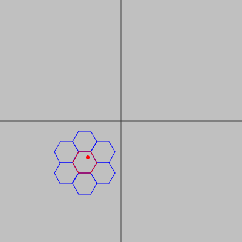
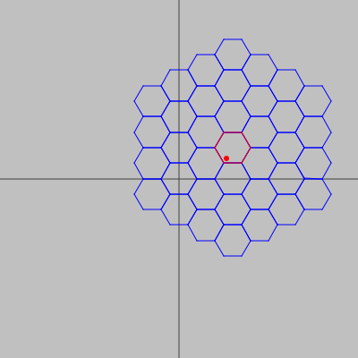

# Grid Hex

Minimalist Scala library to convert world coordinates to hex lattice coordinates based on <http://www.redblobgames.com/grids/hexagons> excellent reference [implementation](http://www.redblobgames.com/grids/hexagons/implementation.html).



This library implements the following functions:
- Convert XY world coordinates into Hex RowCol.
- Convert Hex center into XY world coordinates.
- Get a sequence of the Hex corners in world coordinates.
- Get a sequence of Hexes that are within a user defined range from a given Hex.

## Building the Project

The build process is based on [sbt](http://www.scala-sbt.org/).

```
sbt clean cleanFiles transitiveUpdate +publishM2 +publishLocal
```

## Hex Viewer

`HexApp` is a simple CLI application to view the above functions in action.

View the app usage using:

```
sbt "run -help"
```

The following is a sample execution:

```
sbt "run -w 400 -h 400 -x 253 -y 177 -r 3 -o /tmp/test.png" && open /tmp/test.png
```

